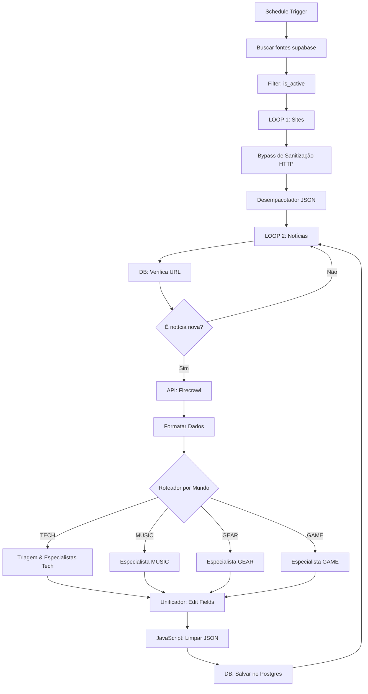

# 🔗 n8n Workflow — Arquitetura Multiverso (Configuração Prática)

Este documento detalha como adaptar o seu fluxo atual do n8n (`My workflow.json`) para integrar perfeitamente os novos mundos (`MUSIC`, `GEAR` e `GAME`), herdando de forma automática as novas fontes e gravando os posts nas taxonomias corretas no banco de dados do Supabase.

---

## 🎯 As Três Fragilidades do Fluxo Atual
1. **Hardcoded para TECH**: O nó `Roteador` e os nós especialistas assumem que todas as notícias que entram no pipeline são de tecnologia (`TECH_HACKER`), fazendo com que qualquer notícia de música ou hardware seja filtrada ou processada incorretamente.
2. **Mapeamento de Mundo Ausente**: No nó final `DB: Salvar no Postgres`, a coluna `world` não está mapeada. Como o banco de dados tem o valor padrão `'TECH'`, todas as notícias de outros mundos seriam gravadas incorretamente como `'TECH'`.
3. **Mapeamento de Categoria Genérica**: O Diretor de Triagem atual só conhece as subcategorias de tecnologia (`IA`, `DEV`, `SEC`, `CLOUD`).

---

## 🏗️ Nova Topologia Proposta para o Fluxo Único

Em vez de criar múltiplos fluxos, a forma mais eficiente é usar um **Roteador por Mundo** no seu fluxo atual. O pipeline consolidado funcionará assim:



---

## 🛠️ Passo a Passo das Modificações no n8n

### 1. Atualizar o nó `Buscar fontes supabase`
A coluna `world` que adicionamos no Supabase será importada automaticamente pelo nó de consulta. Certifique-se de que a query traga essa coluna (a operação padrão de `Select All` fará isso).

---

### 2. Substituir a Triagem por um Switch de Mundo (Roteador)
Substitua o nó `Roteador` antigo (que ficava no início do processamento da IA) por um nó do tipo **Switch** chamado `Roteador de Mundo`:
*   **Valor a testar**: `={{ $('LOOP 1 (Sites)').item.json.world }}`
*   **Regras de Saída**:
    *   Rota 1 (String equals): `TECH` ➔ Direciona para o seu fluxo atual (`IA: Especialista Tech`)
    *   Rota 2 (String equals): `MUSIC` ➔ Direciona para o novo nó `Especialista MUSIC`
    *   Rota 3 (String equals): `GEAR` ➔ Direciona para o novo nó `Especialista GEAR`
    *   Rota 4 (String equals): `GAME` ➔ Direciona para o novo nó `Especialista GAME`

---

### 3. Configurar os Novos Nós Especialistas de IA
Crie 3 novos nós de **OpenAI/Anthropic** (um para cada mundo) e conecte-os nas saídas correspondentes do `Roteador de Mundo`. Utilize os prompts que estruturamos em [docs/prompts/rss_prompts_e_fontes.md](file:///c:/Users/wheslan.quintanilha/Documents/freshnews_mobile/docs/prompts/rss_prompts_e_fontes.md):

#### 🎵 Nó: `Especialista MUSIC`
*   **System Prompt**:
    ```markdown
    Você é o Especialista em Música (Beats & Noise) da Fresh News. Sua missão é analisar notícias técnicas de som e lançamentos do circuito independente.
    O seu resumo final DEVE ser em Português Brasileiro (pt-BR).

    REGRAS EDITORIAIS DE DENSIDADE:
    1. PROIBIDO jargão de marketing ("álbum incrível", "artista imperdível").
    2. OBRIGATÓRIO focar em dados de produção (sintetizadores modulares, plugins, DAWs, selos, formatos de disco).
    3. Categorias válidas no JSON final: [ARTISTAS, PRODUÇÃO, INDIE, CHARTS, LANÇAMENTOS].

    CONTRATO DE SAÍDA (JSON estrito):
    {
      "title": "Título brutalista focado no artista/tecnologia em pt-BR (Máx 60 chars)",
      "summary": "Resumo denso do lançamento, equipamento ou tese artística (Máx 280 chars)",
      "whatsapp_summary": "🎵 [Título curto]. [Equipamento/Artista]. [Veredicto]. Máx 160 chars.",
      "relevance_score": [Número de 0 a 100],
      "theme_config": {
        "dna": "SYNTHWAVE_PURPLE",
        "primary_color": "#0D0D0D",
        "accent_color": "#A855F7",
        "font_style": "Mono",
        "ui_effects": ["neon_glow", "scanlines"]
      }
    }
    ```

#### ⚙️ Nó: `Especialista GEAR`
*   **System Prompt**:
    ```markdown
    Você é o Especialista em Hardware e Engenharia (RPM & Gadgets) da Fresh News. Sua missão é analisar modificações automotivas, chips, DIY e IoT.
    O seu resumo final DEVE ser em Português Brasileiro (pt-BR).

    REGRAS EDITORIAIS:
    1. PROIBIDO termos promocionais corporativos.
    2. OBRIGATÓRIO citar componentes físicos, torque, especificações elétricas, barramentos e código aberto.
    3. Categorias válidas no JSON final: [AUTOMOTIVO, GADGETS, WEARABLES, DIY, INOVAÇÃO].

    CONTRATO DE SAÍDA (JSON estrito):
    {
      "title": "Título técnico com foco em specs em pt-BR (Máx 60 chars)",
      "summary": "Resumo denso focando na física, hardware ou engenharia reversa (Máx 280 chars)",
      "whatsapp_summary": "⚙️ [Título]. [Componente/Fato]. [Specs/Voltagem]. Máx 160 chars.",
      "relevance_score": [Número de 0 a 100],
      "theme_config": {
        "dna": "GEAR_RED",
        "primary_color": "#0D0D0D",
        "accent_color": "#EF4444",
        "font_style": "Mono",
        "ui_effects": ["terminal_cursor", "scanlines"]
      }
    }
    ```

#### 🎮 Nó: `Especialista GAME`
*   **System Prompt**:
    ```markdown
    Você é o Especialista em Games (Arcade & Pixel) da Fresh News. Sua missão é analisar desenvolvimento indie, emulação, patches e táticas competitivas.
    O seu resumo final DEVE ser em Português Brasileiro (pt-BR).

    REGRAS EDITORIAIS:
    1. PROIBIDO focar em gráficos ou marketing.
    2. OBRIGATÓRIO focar em mecânicas brutas (frame data, emulação, código de descompilação, game design).
    3. Categorias válidas no JSON final: [PC, CONSOLE, MOBILE, ESPORTS, INDIE].

    CONTRATO DE SAÍDA (JSON estrito):
    {
      "title": "Título focado no jogo ou tecnologia em pt-BR (Máx 60 chars)",
      "summary": "Resumo focado nas mecânicas de gameplay ou dados do emulador (Máx 280 chars)",
      "whatsapp_summary": "🎮 [Título]. [Mecânica/Plataforma]. [Impacto/Veredicto]. Máx 160 chars.",
      "relevance_score": [Número de 0 a 100],
      "theme_config": {
        "dna": "GAME_GOLD",
        "primary_color": "#0D0D0D",
        "accent_color": "#EAB308",
        "font_style": "Mono",
        "ui_effects": ["scanlines", "pulsing_borders"]
      }
    }
    ```

---

### 4. Ligar a Saída dos Especialistas no Unificador
Conecte as saídas dos 3 novos nós especialistas ao mesmo nó unificador (`Edit Fields3` ou os nós equivalentes de mapeamento) para que eles sigam em direção ao nó de salvamento no banco.

---

### 5. Ajustar o Nó JavaScript de Limpeza do JSON (`Code in JavaScript1`)
No seu nó `Code in JavaScript1` (linha 921), o código de sanitização de strings está excelente. Apenas garanta que ele propague a variável `world` que está fluindo do loop de sites:

```javascript
// Adicione o mapeamento do world no objeto de retorno do return:
return {
  json: {
    title: parsedIA.title || "Sem título",
    summary: parsedIA.summary || "",
    whatsapp_summary: parsedIA.whatsapp_summary || "",
    score: parsedIA.relevance_score || 0,
    theme_config: parsedIA.theme_config || {},
    
    url: data.url, 
    category: data.category, 
    sub_category: data.sub_category,
    
    // NOVO: Propagar o mundo de origem do feed
    world: data.world || "TECH"
  }
};
```

---

### 6. Mapear a Coluna `world` no Nó `DB: Salvar no Postgres`
Abra o nó `DB: Salvar no Postgres` (linha 290) e insira a nova coluna no mapeamento de inserção:
*   **Coluna**: `world`
*   **Valor**: `={{ $json.world }}`

Isso garante que a notícia seja gravada no Supabase exatamente no mundo (`MUSIC`, `GEAR` ou `GAME`) ao qual seu feed RSS pertence, permitindo que a tela correspondente do app carregue a notícia automaticamente!
