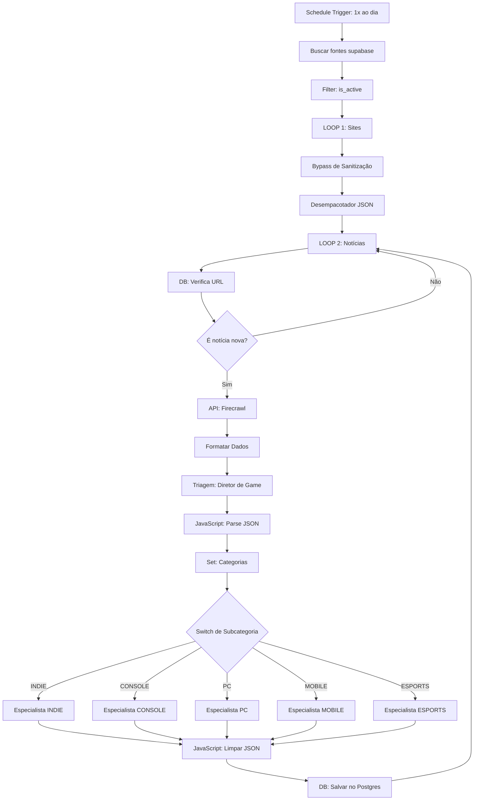

# ⏱️ Cron & Estratégia de Fluxos n8n por Mundo

Este documento especifica a estratégia de frequências de execução (crones) e a arquitetura de fluxos separados no n8n para os mundos `MUSIC`, `GEAR` e `GAME`, mantendo o mesmo processo de **Triagem ➔ Especialistas** que você já implementou com sucesso no mundo `TECH`.

---

## 📅 1. Tabela de Frequências (Cron) Recomendadas

Como os mundos possuem dinâmicas e velocidades de notícias diferentes, rodar tudo na mesma frequência causaria desperdício de processamento e tokens de IA. Aqui está a calibração recomendada:

| Mundo | Frequência (Cron) | Cron Expression | Justificativa |
| :--- | :--- | :--- | :--- |
| **💻 TECH** | Diariamente (Fixo) | `0 5 * * *` (Todos os dias às 05:00) | Ingestão diária para compilar o feed de cibersegurança, DEV e IA das últimas 24h. |
| **🎮 GAME** | A cada 2 dias | `0 6 */2 * *` (A cada 2 dias às 06:00) | Acumula updates de emuladores e lançamentos indie, gerando material para edições em dias alternados. |
| **🎵 MUSIC** | A cada 3 dias | `0 7 */3 * *` (A cada 3 dias às 07:00) | Ciclo de vida longo para novos álbuns e reviews de equipamentos de produção. |
| **⚙️ GEAR** | A cada 4 dias | `0 8 */4 * *` (A cada 4 dias às 08:00) | Projetos makers (DIY) e telemetria automotiva são atemporais; ingestão espaçada economiza tokens. |

---

## 🏗️ 2. Topologia do Fluxo Separado (Exemplo: GAME)

Duplicando o seu fluxo atual do TECH, você terá um fluxo isolado para o mundo **GAME**. As modificações necessárias em cada nó são:



### 1. Nó `Buscar fontes supabase` (Postgres)
Modifique a query para carregar apenas as fontes do mundo de jogos:
```sql
SELECT * FROM public.sources WHERE is_active = true AND world = 'GAME';
```

### 2. Nó `Diretor de Triagem` (OpenAI/Anthropic)
*   **System Prompt**:
    ```markdown
    Você é o Diretor de Triagem do mundo GAME (Arcade & Pixel) da Fresh News. A sua única função é analisar o Markdown fornecido e classificar a notícia nas subcategorias corretas.

    Deves retornar apenas um objeto JSON estrito com esta estrutura:
    {
      "category": "GAME",
      "sub_category": "PC" | "CONSOLE" | "MOBILE" | "ESPORTS" | "INDIE"
    }

    Regras de Classificação:
    - INDIE: Jogos experimentais de game jams, Pico-8, itch.io, devlogs e estúdios independentes reais (sem marketing corporativo).
    - CONSOLE: Emuladores, ROM hacking, consoles clássicos e portáteis retro de hardware aberto.
    - PC: Mods de PC, recompilações nativas de jogos clássicos, otimizações gráficas de baixo nível.
    - MOBILE: Ports premium nativos para iOS/Android, discussões técnicas de Metal/Vulkan.
    - ESPORTS: Patch notes competitivos, análises táticas de posicionamento, updates de balanceamento/meta.
    ```

### 3. Nó `Switch` (Roteador de Subcategorias)
Configure as 5 rotas apontando para cada especialista correspondente: `INDIE`, `CONSOLE`, `PC`, `MOBILE` e `ESPORTS`.

### 4. Prompts para os Especialistas de Game (JSON Outputs)
Cada especialista reescreverá a notícia aplicando a vibe e configurações de CSS brutalista para o app:
*   **Especialista INDIE**: Accent Color: `#10B981` (Verde Esmeralda). UI Effects: `['scanlines', 'terminal_cursor']`.
*   **Especialista CONSOLE**: Accent Color: `#DC2626` (Vermelho Nintendo). UI Effects: `['pulsing_borders', 'scanlines']`.
*   **Especialista PC**: Accent Color: `#EAB308` (Amarelo Ouro). UI Effects: `['grainy_texture', 'scanlines']`.
*   **Especialista MOBILE**: Accent Color: `#06B6D4` (Ciano Plasma). UI Effects: `['glassmorphism', 'scanlines']`.
*   **Especialista ESPORTS**: Accent Color: `#3B82F6` (Azul Competição). UI Effects: `['crt_flicker', 'scanlines']`.

### 5. Nó `DB: Salvar no Postgres` (Postgres)
Adicione o campo `world` fixado como `'GAME'` na inserção:
*   **Coluna**: `world`
*   **Valor**: `GAME`

---

## 🎵 3. Adaptação para o Mundo MUSIC
Seguindo o mesmo processo, o fluxo de **MUSIC** terá:
*   **Query**: `world = 'MUSIC'`
*   **Subcategorias**: `ARTISTAS`, `PRODUÇÃO`, `INDIE`, `CHARTS`, `LANÇAMENTOS`.
*   **Especialistas**:
    *   *ARTISTAS*: Foco em perfis, turnês e manifestos. Color: `#EC4899` (Rosa Sintético).
    *   *PRODUÇÃO*: Foco em DAWs, plugins, sintetizadores Eurorack. Color: `#A855F7` (Púrpura Modular).
    *   *INDIE*: Foco em selos underground, fanzines, fitas cassete. Color: `#14B8A6` (Teal).
    *   *CHARTS*: Estatísticas de audição, dados do Last.fm/Apple. Color: `#3B82F6` (Azul Analítico).
    *   *LANÇAMENTOS*: Lançamentos de discos físicos e novas faixas. Color: `#F59E0B` (Âmbar).
*   **Banco**: Inserir com `world = 'MUSIC'`.

---

## ⚙️ 4. Adaptação para o Mundo GEAR
O fluxo de **GEAR** terá:
*   **Query**: `world = 'GEAR'`
*   **Subcategorias**: `AUTOMOTIVO`, `GADGETS`, `WEARABLES`, `DIY`, `INOVAÇÃO`.
*   **Especialistas**:
    *   *AUTOMOTIVO*: Swaps de motor, telemetria, ECU, aerodinâmica. Color: `#EF4444` (Vermelho Nitro).
    *   *GADGETS*: Dispositivos modulares, e-ink, UMPCs, ARM/RISC-V. Color: `#F59E0B` (Laranja Cobre).
    *   *WEARABLES*: Hardware vestível aberto, sensores biométricos. Color: `#EC4899` (Rosa Fisiológico).
    *   *DIY*: Soldagem de circuitos, Arduino, Raspberry Pi, Make. Color: `#10B981` (Verde Graxa).
    *   *INOVAÇÃO*: Robótica acadêmica, semicondutores, IEEE. Color: `#3B82F6` (Azul Cobalto).
*   **Banco**: Inserir com `world = 'GEAR'`.

---

## 💎 Vantagens desta Abordagem de Fluxos Separados
1. **Facilidade de Depuração**: Se um nó do mundo `GAME` quebrar (por exemplo, a API do TouchArcade mudar), o pipeline de tecnologia (`TECH`) continua funcionando sem interrupções.
2. **Controle Financeiro (Tokens)**: Você pode desativar o fluxo de `GEAR` temporariamente no n8n se precisar economizar tokens, sem afetar o fluxo principal do app.
3. **Calibração Fina**: Você pode rodar testes de prompts refinando o tom de fanzine de música (`MUSIC`) sem tocar em nenhuma regra do Threat Intel (`TECH`).
